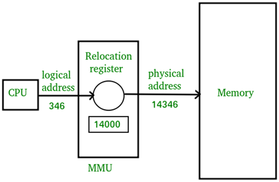
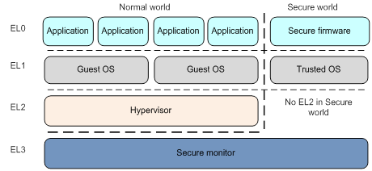

# TheLinuxWays

## SoC (System on Chip) 内部的结构
说起Linux, 那么我们不得不补一下操作系统原理相关的东西.  
我废话不多说, 因为讲到最后可能又是一本书了. 我只快速说你可能感兴趣的.  

## 内存访问模型
我们知道, 计算机有CPU, 有内存, 有外设... 我来借用一张图来说明一下:  

其实这就是一个最简单的内存访问模型. 它展示了4个CPU, 通过一个内存总线, 连接到了一个内存上.  
当然, 实际情况中, CPU内部可能还有指令缓存(I-cache), 数据缓存(D-cache). 没关系, 这不影响我们的理解.  

在嵌入式(或者说SoC)平台当中, 我们主要关注的是CPU和内存, 尤其是内存.  
为什么这么说? 因为你拿到的内存很可能是这个样子的:  

这是ESP32的内存映射图.  

嗯, 说好的内存呢? 怎么还有这么多东西? 没错, 聪明的你肯定又发现问题了.  
与其说是内存, 不如说造芯片的这群人为了指令集精简, 它硬是把一些硬件外设, 也假装自己是内存, 用内存读写指令访问特定的地址去控制啊!  
现在是不是感觉有点不对劲了? 好像之前课本上教的那些东西一夜之间全部报废啊...

没事, 不要害怕, 其实你学过的知识依然是正确的. 只不过, 以前的时候, 为了方便你的理解, 他们帮你精简了一些东西.  
让我们继续往下看.  

这是怎么实现的呢? 很抱歉, ESP32的pdf没有给出具体的实现细节.  
但是问题不大, 我借一张Allwinner A40i的图来展示一下:  (你会发现我在多个不同的芯片平台来回切换, 而且这样也能表达清楚我的意思. 这刚好说明了它们的思想都是一样的)  

*无视这个Confidential, 实际上这个资料[来源于互联网](https://linux-sunxi.org/File:V40_Product_Brief.pdf), 这个水印已经没有任何意义了.*    
*以后这样的事情会经常见到的, 习惯就好.*  

这张图展示了Allwinner A40i内部的总线结构. 可以看到, 他们之间全部都是用总线来连接的.  
这里的总线有AXI总线, 有AHB总线, 有APB总线... 没关系, 我们不需要知道这些总线的具体细节, 你知道这几个名字即可. 以后如果研究FPGA的话, 你会知道这些总线的细节的.  
*跑题一下: 这系列文章中出现的所有东西, 你都只需要知道名字即可. 这不是考试, 你不需要死记硬背. 我需要的就是快速的让你了解这个世界里面你可能遇到的全部东西.  如果你感兴趣, 你可以自己去深入搜索每一个具体东西的细节实现.*  

这些总线, 共同把包括真正的内存在内的所有东西连接起来. 你可以把总线理解为一条公路, 你可以通过这条公路, 从一个地方到达另一个地方.  
除了把所有的东西连接起来, 总线的另一个功能就是编码. 也就是**内存地址映射**, 也正是俗称的**寄存器的地址**.

把想要的东西连接到总线的不同地址线上, 这样在CPU端就会感觉到访问了不同的地址范围, 控制了不同的硬件外设.  

## MMU (Memory Management Unit) 内存管理单元
我们已经知道, CPU是通过总线, 用不同的地址, 访问不同的硬件外设.  
那么你会不会说, 为什么我平常在Linux下面写程序的时候, 却从来没遇到过访问内存就可以控制外设的情况呢?  
所以我们现在有必要说一说MMU.  

MMU, 顾名思义, 最常做的事情就是虚拟内存. 它可以实现动态修改虚拟内存和物理内存的映射关系, 设置内存的访问权限, 用于起到一些保护的作用.  
假如没有MMU的话, 那么你确实是可以随便写这些外设的寄存器地址, 就可以控制不同的硬件外设了. 在一些没有MMU的平台上, 这样的方法很常见, 比如一些单片机, STM32, ESP32...
因为这些单片机为了节省成本和降低功耗, 都没有装备MMU(同时大部分也没有MPU). 所以如果它们正在运行RTOS (Real Time Operating System), 你甚至可以直接跨进程访问其他进程的内存, 甚至是把操作系统内核的内存给篡改掉.  

显然这样做非常不妥. 这会带来严重的安全灾难.  
正因为这个原因, 稍微复杂一点的平台, 都会装备MMU. 至少, 我们也得把用户进程和操作系统内核, 以及硬件外设的内存地址隔离开来吧?  

正因为这个原因, MMU横空出世.  

此外MMU的另一个功能是分页. 将物理内存分为很多页, 每个页的大小是固定的(通常是4KB, 对应16进制下的0x1000).  
这样以来, 只需要组合这些页, 就可以拼凑出一个完整而且连续的虚拟内存, 彻底解决掉内存碎片的问题.  

不仅如此, 这些页还可以在内存不足的时候被换入硬盘当中. 虽然这样做会显著降低计算机的运行效率, 但是它在内存紧凑的时候提供了一个很好的解决方案 - 系统不会再因为内存不足而应声崩溃.  

值得一提的是, 有MMU的平台不代表MMU一定是被启用的状态. 例如, 通常情况下u-boot引导程序就直接运行在物理内存上. 下次遇到了不妨打一个md和mw命令试试, 你会发现, 你可以直接控制硬件外设.

如果你对此感到非常好奇, 你也可以在获得了root权限的Linux系统上, 通过/dev/mem文件, 直接访问物理内存. 使用工具[devmem2](https://github.com/radii/devmem2)就可以实现.  
建议配合一个Linux开发板来玩一玩, 因为这样的平台通常会提供芯片的pdf资料, 有助于你一览所有的硬件外设.  

## CPU特权等级
我们知道了MMU可以用来隔离和保护内存. 那么既然这样, 岂不是只要操作MMU, 就可以随意访问不属于自己的内存了?  
理论上是这样, 但是我们肯定不会让你这么做的. 很显然, CPU的设计师们已经帮你考虑到这个问题了.  
这就是CPU的**特权等级**. 在不同的级别下, CPU能执行的指令是不一样的. 一些特权指令, 只有在特权等级较高的时候才能执行.  
这样, 只要操作系统在设置完MMU之后, 再把自己的特权等级降低, 然后再跳转到用户进程执行用户的代码, 那么用户就没办法再操作MMU了.  

特权等级在不同的CPU架构上都不一样:  
- x86架构, 有4个特权等级, 分别是ring0, ring1, ring2, ring3.  
- aarch64架构, 有3个特权等级, 分别是EL0, EL1, EL2, EL3.  
- risc-v架构, 有3个特权等级, 分别是M-mode, S-mode, U-mode.  
- mips架构, 有4个特权等级, 分别是kernel, supervisor, user, debug.  

以aarch64结构为例子, 让我们看一下不同的特权等级, 一般用于来做什么事情:  

- EL0, 也就是用户态. 一般用于运行用户进程. 你在Linux下面运行的程序, 就是运行在这里的.
- EL1, 也就是内核态. 一般用于运行操作系统内核. Linux内核就是运行在这里的.
- EL2, 也就是hypervisor态. 一般用于运行虚拟机, 当然一些bootloader也可能会运行在这里, 如u-boot.
- EL3, 也就是secure monitor态. 一般用于运行安全相关的代码, 如ATF (ARM Trusted Firmware).

我们去找一个rockchip的芯片的资料, 看一下它的启动流程, 进而对特权等级有更高的理解.

这张图其实并没有明确的写出来每个阶段的特权等级, 但是我们可以根据它的启动流程, 推断出来. 让我来解释一下:

1. 首先, CPU上电, 运行在EL3态. 这是CPU的最高权限状态. 这很容易理解, 如果不这样做, 那么这个CPU将会开机自锁, 彻底无法使用.  
2. 然后, CPU从BootROM开始执行代码. BootROM通常是一段代码被编译后, 生产过程中光刻在芯片上的, 无法再去做修改(*但是也不绝对, 有些芯片有一些overlay寄存器可以定向覆盖掉其中的少量指令*). 
3. BootROM负责校验外部存储器中的镜像, 并且把镜像加载到内存当中. 这个过程中, CPU仍然运行在EL3态. 图中的BootROM拉起了一个二阶段的引导, 也就是idbloader.img. 这个文件可以是官方的, 也可以是u-boot开源生态的. 
4. 根据idbloader.img的内容不同, 又有不同的执行流程. 以u-boot方案为例, idbloader负责将u-boot本体和bl31(Arm Trusted Firmware)加载到内存当中. 之后, idbloader执行ATF, 由ATF将CPU的特权等级降低到EL2态, 并且跳转到u-boot本体. 而ATF自身则就此常驻于EL3, 用于后续提供安全相关的服务. 
5. u-boot本体被加载到内存当中, 并且被执行. 这个时候, CPU的特权等级已经被降低到EL2态. u-boot本体负责将CPU的特权等级降低到EL1态, 并且读取并跳转到Linux内核.
6. Linux内核就此常驻于EL1态运行. 之后, 所有的用户应用程序都将被Linux内核加载并启动, 由Linux内核管理它们, 并且降权它们运行在EL0态.

这样一来, 除非高权限的服务有什么漏洞, 否则用户态的程序想恶意篡改系统是不可能的. 大大提高了系统的安全性.  

## 服务调用和中断

我们已经知道, CPU的特权等级不同, 可以执行的指令也不同. 那么这些不同等级的代码, 难道就此孤立, 永远打死不相往来了吗?  
当然不是, 他们之间还是可以相互通信的. 这时候有必要提一下什么是**服务调用**和**中断**.  

关于**服务调用**, 你可以理解为, 低特权等级的代码, 通过一些特殊的指令, 调用高特权等级的代码. 也叫syscall.  

举个最简单的例子, 用户态程序理论上不具备任何权限. 但是它可以读写硬盘中的文件, 可以发起网络请求, 可以访问硬件外设... 这是如何做到的?  
这就是通过服务调用来实现的. 用户态程序通过一些特殊的指令, 从而产生一个**软件中断**. 操作系统内核作为用户态程序的上级, 会捕获到这个软件中断.  
此时的操作系统内核可以校验用户操作的合法性, 以及用户有没有权限这样做, 然后再去执行用户的请求. 最终, 操作系统内核将结果返回给用户态程序.  
而这一切, 对于用户态程序来说, 就只是一个普通的CPU指令而已. 执行了这个指令, CPU就莫名其妙的把一切东西都处理好了. 也就是说, 用户态程序完全不知道, 自己的请求是如何被执行的. 它也不需要知道.  

以此类推, 操作系统内核如果需要向ATF发起请求, 也是一样的思路. 

这样的一个做法, 甚至可以实现在CPU内部创建安全世界和非安全世界, 从而实现安全的硬件加密. 因为非安全世界无法直接访问安全世界的内存, 也无法直接访问安全世界的硬件外设.  
它只能通过服务调用, 从而间接的访问安全世界提供的功能. 这样的做法, 也就是所谓的**ARM TrustZone**.  

关于**中断**, 如果你玩过Arduino, 那么你应该会有一些了解.  

当外设需要CPU的处理时, 会向CPU发起一个中断请求. CPU立马就会停下手头的工作, 自动跳转到中断处理程序, 处理完毕之后, 再回到原来的工作.  
而在特权等级之上, 中断显得额外重要. 为什么这么说?  

因为syscall自己就是一个中断, 只不过它是软件发起的而已. 这是最一针见血的解释.  

中断也叫异常. 中断可以用于提升权限. 这样设计的原因是, 一般由于用户态产生的中断, 用户态自己肯定是接不住的. 它可能是因为用户态程序的bug让用户态程序发生了崩溃, 也可能是因为用户态程序的恶意行为, 也可能是一次正常的操作系统调用. 更可能是一个硬件外设的完成...  
总之, 用户态肯定是没办法自己处理的. 所以必须要提升权限, 交给操作系统内核来处理. 

那么, 因为这样的原因, 中断的思路就变成了先提升权限, 再跳转到上一级的中断处理程序开始执行. 中断处理程序执行完毕之后, 再降低权限, 回到原来的工作.  

此外, 还有一种很特殊的中断是**定时器中断**. 

定时器, 玩过Arduino的玩家应当一定不陌生. 它可以用来做很多事情, 最常见的是当定时器到达指定的时间时, 产生一个中断.  
在现代化操作系统上, 定时器中断的作用更加广泛. 它可以用作**操作系统任务调度**.  

操作系统可以将定时器设置为一个固定的频率, 比如1000Hz. 这样一来, 每隔1ms, 定时器就会产生一个中断.  
当CPU收到这个中断之后, 就会无条件的跳转到操作系统内核的中断处理程序. 操作系统就可以借机会保存当前执行的上下文, 然后切换到下一个进程.  
这样一来, 操作系统就可以实现多任务调度了. 现在你是不是终于知道, 为什么操作系统可以在同一个CPU上, 同时运行多个程序了?  
其实它们并不是同时运行的, 而是操作系统在不停的切换它们. 然而因为切换的太快了, 你根本感觉不到. 仅此而已.  
而且对于用户态程序来说, 它们也不知道自己被切换了. 表现就是它们都认为自己在同时运行.  

## 总结

这篇文章快速的介绍了一下操作系统原理和计算机组成原理相关的知识. 这些知识以前可能没人告诉过你, 但是这些知识刚好是最重要的东西.  
有了这些知识, 将会帮助你更好的理解Linux的世界. 毕竟这是一个操作系统, 你必须要知道它是如何工作的.

其实操作系统原理和计算机组成原理, 还有编译原理, 每一个都是一本书. 我不可能在这么短的时间内, 把所有的东西都讲清楚.  
因此如果你感兴趣, 你可以自己去搜索相关的资料, 深入学习. 不求甚解, 只要知道它们的世界里面都是一些什么东西即可. **这将会对你有巨大的帮助.**  
