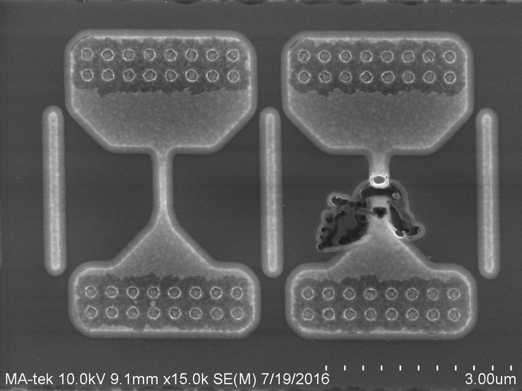
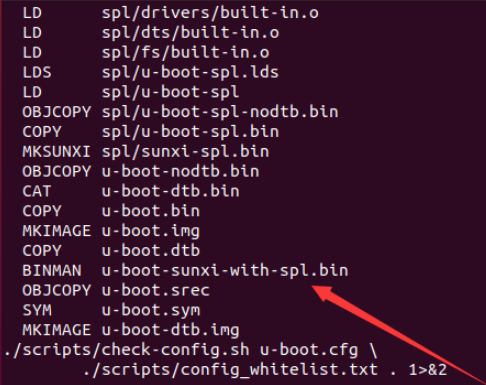
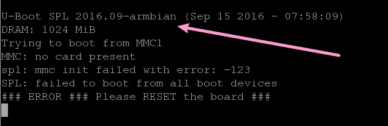
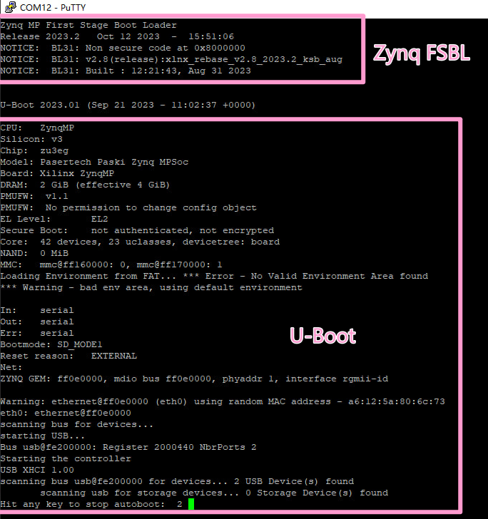
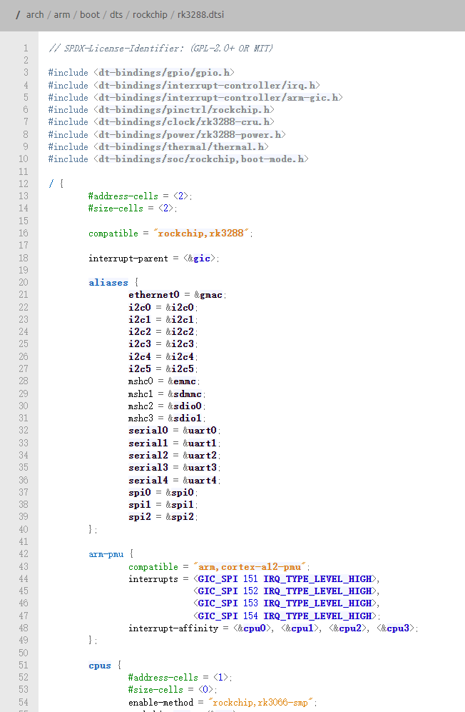
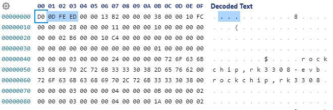
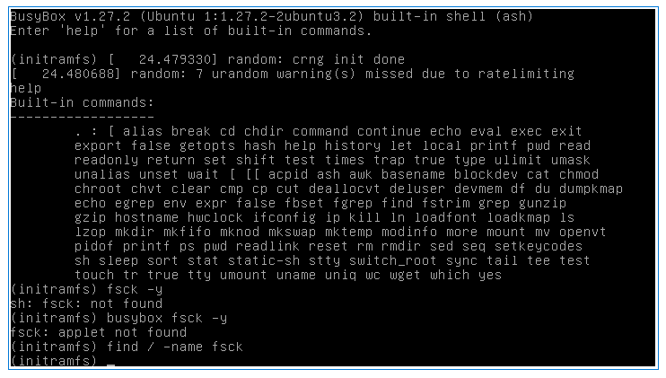

# TheLinuxWays

## 启动顺序
VFS的旅程是轻松的, 接下来我们要研究一些更加复杂的东西了.  
这一章, 将直接关系到你该如何移植Linux到一个新的平台上, 以及整机调试的基本思路.  

不同的CPU, 启动顺序是不同的. 让我们来大致看一下不同CPU的启动流程:

- x86: 厂商私有底层初始化 -> UEFI环境 -> grub -> Linux内核 -> initramfs/initrd -> rootfs根文件系统
- arm: 厂商私有BootROM代码初始化 -> 第一阶段BL (通常是u-boot spl或者其他) -> U-Boot -> Linux内核 + DTB -> initramfs/initrd -> rootfs根文件系统
- riscv: 厂商私有BootROM代码初始化 -> 第一阶段BL (通常是u-boot spl或者其他) -> U-Boot -> Linux内核 + DTB -> initramfs/initrd -> rootfs根文件系统

当然, 这个结构并不是绝对的. 但是不管怎么样, 你会发现基本都分成了几个部分:  

- BootROM
- First stage bootloader, 第一阶段引导程序
- U-Boot
- DTB (Device Tree Blob), 设备树
- Linux内核
- initramfs / initrd
- rootfs根文件系统

接下来让我们一个个来认识这些都是个啥.  

## BootROM
前面第一章说过, CPU上电之后, 第一个执行的代码, 就是BootROM.  
BootROM, 顾名思义, 通常情况下是光刻在芯片上的代码, 在芯片生产的时候就已经决定好了. 这段代码后期几乎不可能修改, 除非芯片有什么特殊后门.  
常见的修改操作是, 通过一些寄存器, 覆盖掉其中的少量指令, 用于厂商后期补丁生产时带来的缺陷. 

BootROM的主要功能, 通常是初始化一些关键硬件, 并且负责加载第一阶段引导程序.  
绝大多数时候, BootROM里面会有一些应急恢复使用的代码. 当你的系统无法启动的时候, 你可以通过一些特殊的操作, 让CPU跳转到BootROM中的这些代码, 从而恢复系统.  
例如Allwinner的FEL模式, Rockchip的Maskrom模式, 以及很多高通手机的9008模式(真正名字是EDL - Emergency Download Mode).  
通常情况下, 触发这样的模式包括不限于:
- 按住特定的按键, 例如音量键, 电源键, 重置键等
- 短路特殊的引脚, 例如FEL Pin
- Flash中的数据校验失败或无效的镜像文件头
- 其他的各种组合技...

也正因为BootROM这样不可修改的特性, 所以往往BootROM非常适合用来做一些安全校验相关的事情. 它可以被用来把好芯片安全的第一道关卡.  
在SoC平台上, 通常还会存在一种叫做`eFuse`的东西. 这是一种电熔丝, 只能烧断, 不能复原. 



BootROM里面可以硬塞一点代码, 根据烧断的eFuse, 来判断是否启用或者禁用一些安全功能.  
例如, 厂商可以在BootROM里面加一段代码, 用于校验外部存储器中的镜像, 如果校验失败, 那么就不会去加载镜像, 从而防止被篡改的镜像的启动.  
而eFuse, 则可以用来存储一些密钥, 并且决定这个功能是否启用.  
这就是**安全启动**, 也就是俗称的*芯片上锁*. 相信有不少的玩家买到过上锁的ESP32, Allwinner, Rockchip... 到手就是大砖头, 深受其害.  
一句话就是, **没有厂家对应的密钥, 你就别想启动这个芯片**.  

有盾自然就有矛, 之前说过, 有时候厂商为了防止自己的BootROM有缺陷, 会预留一些不为人知的寄存器可以小幅度修改BootROM中的零星代码.  
这样的寄存器往往是致命性的. 通常厂商不会愿意将这样的寄存器公开在pdf上, 以免被人利用.  
但是通过一些逆向手段, 如反汇编BootROM本身, 或者分析固件升级包, 这样的寄存器往往会意外泄漏在公众面前.  
攻击者可以利用这些寄存器破坏保存在BootROM中的代码, 从而改变BootROM的逻辑, 绕过一些安全校验措施. 而这样的破坏往往是灾难性的后果, 致使整个批次的芯片, 其安全性都被彻底破坏.  

此外, 关于BootROM安全, 更大的威胁是潜在的逻辑错误和缓冲区溢出.  
一个例子是Tegra X1芯片的[fusée gelée漏洞](https://misc.ktemkin.com/fusee_gelee_nvidia.pdf), 因为Nvidia忘记了校验USB协议栈中的wlength参数, 导致攻击者可以通过BootROM当中的USB恢复模式, 直接破坏BootROM的执行栈, 劫持CPU的执行流程, 从而以EL3的最高权限拿到整个系统的控制权.   

当然, 大多数情况下, 我们玩自己的开发板, 都不会使用BootROM的安全功能.  

## FSBL: 第一阶段引导程序
第一阶段引导程序, 通常是指BootROM之后的第一个引导程序. 一般情况下, 它是由厂商提供的, 但是也有可能是开源的.  
对于开源的实现, 例如Armbian, 通常会使用u-boot的spl (Second Program Loader)作为第一阶段引导程序.  





第一阶段引导程序的主要功能, 通常是进一步初始化硬件, 为接下来的引导程序(如u-boot)做准备.  
以u-boot spl为例, 它包含的功能通常如下:  
- 初始化DDR内存控制器, 使得CPU可以访问DDR内存
- 初始化串口, 用于后续调试
- 对CPU的cache, PLL等进行初始化, 使CPU可以正常工作在指定频率
- 初始化外部存储器, 例如SPI Flash, eMMC, SD卡等
- 从外部存储器寻找u-boot镜像, 并且加载到DDR内存中, 进而跳转到u-boot镜像中的代码执行

第一阶段引导程序的代码, 通常是被编译成一个二进制文件, 然后通过一些工具, 写入到外部存储器中的特定位置.  
它的具体二进制格式, 以及这个特定位置, 通常是由厂商的BootROM决定的.  

看到这里, 你应该发现了, 第一阶段引导程序, 其实就是一个非常简单的裸机程序. (即不需要操作系统的程序.)  
如果能够知道芯片的具体寄存器地址, 你甚至可以直接自己去开发一个第一阶段引导程序.  

不过值得注意的是, 如果BootROM被开启了安全启动校验, 那么第一阶段引导程序很可能是有签名的. 如果签名校验不通过, 那么BootROM就会拒绝去执行它.  
而要签名这个第一阶段引导程序, 如果没有对应的密钥, 那么数学上是几乎不可能做到的.  

*值得一提的题外话是, Allwinner的u-boot spl额外拥有一个回到BootROM的功能, 用于和FEL模式联合使用, 下载u-boot镜像到内存的同时, 传输更多其他需要的数据.*

## U-Boot
提了那么多次U-Boot这个名字, 现在可算是要正式介绍一下了.

[U-Boot](https://github.com/u-boot/u-boot)全称是**通用引导加载器**, 是一个开源的引导程序. 它拥有非常丰富的功能, 例如:  
- 支持多种CPU架构, 包括x86, arm, risc-v, mips等
- 支持多种外部存储器, 包括SPI Flash, eMMC, SD卡, SATA, USB等
- 支持多种文件系统, 包括ext2/3/4, FAT, NTFS, UBIFS, JFFS2等
- 自带一个命令行解释器, 可以实现较为复杂的脚本逻辑
- 支持网络启动, 包括TFTP, NFS等
- 包含一些常用的调试命令, 例如读写内存, 读写寄存器, 读写外设, ping, tftp, dhcp, md5sum等
- 文件结构和设计思路高度和Linux内核相似, 有利于移植
- 可以使用menuconfig等工具, 自定义编译选项, 从而裁剪不需要的功能, 减小体积

U-Boot非常好辨认, 直接看它的启动信息, 就可以知道它是不是U-Boot.  


U-Boot包含了大量的调试功能, 因此, 你可以在U-Boot中做很多调试相关的事情.  
而且这个阶段往往MMU是不会被打开的, 因此, 你可以很方便的访问物理内存, 研究整个CPU.  

因为U-Boot这样一来实在是太强大了, 所以有些时候U-Boot的命令行会被上锁, 不允许用户自己输入命令. 但是这种情况不常见, 本人我没有遇到过.  
值得一提的是, 如果使用了安全启动, 而U-Boot却忘记了校验后面的签名, 或者U-Boot可以呼出命令行, 执行任意命令, 那么安全启动将会变为摆设.  
原因你知道的.  

U-Boot将会根据其环境变量的配置, 拉取Linux内核和DTB(设备树), 并且将它们加载到内存当中. 并且启动Linux内核.  
如果Linux内核使用了initramfs / initrd, 那么U-Boot也会将它加载到内存当中, 一并送给Linux内核处理.  

使用printenv命令可以查看U-Boot的环境变量.  

*如果你有自己的开发板, 那么不妨现在就进入U-Boot研究一下. 如果你对更多的U-Boot命令感兴趣, 可以自行搜索并深入研究.*

U-Boot的源码可以在[bootlin](https://elixir.bootlin.com/u-boot/latest/source)快速索引. bootlin是一个非常好用的源代码索引工具, 可以自行搭建, 也可以使用官方提供的在线版本. 下文不再重复介绍.  
当然, 你的设备实际运行的U-Boot版本, 可能和bootlin上的版本不一样. 它可能被厂商或者开源社区做了一些修改. 但是没关系, 基本思路都是一样的.  

## DTB - 设备树
DTB全称是Device Tree Blob, **设备树二进制文件**, 是一种用于描述硬件设备的数据结构.  
设备树非常重要. 以下是[一个dts设备树的例子, 来自rk3288平台](https://elixir.bootlin.com/linux/v6.7/source/arch/arm/boot/dts/rockchip/rk3288.dtsi).



设备树的思想是, Linux内核一处编译, 处处运行.  
你是不是从来没有听说过x86平台需要关心寄存器什么的, 从来都是`下载iso->安装系统`, 就可以用了.  
其实嵌入式平台的设备树就是想要解决这个问题, 只需要把设备树传递给内核, 内核就会自动解析, 进而加载需要的驱动, 从而让你的系统可以正常工作.  

虽然但是, 这只是个理想. 更多的情况下, 因为Linux生态和厂商的一些原因, 你可能还是要对内核进行一些或多或少的修改.  

但是无论如何设备树都是一个重要的东西, 尤其是你试图给一个新的板子移植Linux, 而这个板子的SoC刚好有别人移植好的Linux内核的时候.  
这时候你几乎什么也不用做, 只要把设备树根据需要改一改, 就可以让那个内核适配你的板子.  
这一招在Allwinner, Rockchip等平台屡试不爽!  

设备树的格式一般都是统一的, 不会随着平台的不同而不同. 特征是文件的开头是0xd00dfeed.  
你甚至可以尝试在固件中搜索这个16进制序列, 搞不好就会有意外收获.  



当然, dtb是编译之后的设备树, 我们能阅读的设备树, 是编译成二进制之前的版本, 也就是dts.  
当然你也可以尝试反编译dtb回dts, 只不过这样的阅读性不是很好. **可如果你找不到可以参考的资料, 你就只能这样做了**. 这是快速逆向分析一个Linux平台的有效手段.    

*题外话: 如果你去看过Linux的源码, 尤其是一些相关的驱动源码, 你就会发现它们使用了`of_`开头的函数来匹配设备树里面的信息. 此外, x86平台不使用设备树, 而是使用ACPI, 也有异曲同工之妙. 这就是为什么我在开头说, 本系列文章不包含x86平台, 但是可以作为一个参考.*

理论上所有设备树的编写资料, 可以在[/Documentation/devicetree/bindings](https://elixir.bootlin.com/linux/v6.7/source/Documentation/devicetree/bindings)找到, 也就是Linux源码自带这些设备树选项的文档.  

*不同的平台, 加载设备树的来源是不一样的, 比如Armbian喜欢从根分区的`/boot`文件夹直接读取并加载, 而xilinx则是和u-boot镜像打包在了一起, 做了个大包. 有些极度裁剪的机器可能根本就不使用设备树, 而是硬编码内核, 需要根据情况分析. 但是不管怎么样, 不影响上面的思路的成立.*

*U-Boot自己可能也会使用和解析设备树, 但是并不是每个平台的U-Boot都会这样做. 有些U-Boot会直接使用自己的配置文件, 例如`board.c`来初始化硬件. U-Boot的设备树语法和结构与Linux的完全一样, 甚至是官方推荐你这样做, 以便可以重复使用. 但是尽管这样, U-Boot所使用的设备树有时候也会和Linux真正拿到的设备树不是同一个副本和来源, 例如Armbian平台, U-Boot自己使用的设备树是直接硬编码在U-Boot尾巴上的.*

## rootfs
rootfs, 顾名思义, 就是根文件系统.  
我们常说的Linux, 其实并不是一个整体. 它是由操作系统内核, 以及一些用户空间的程序共同组成的.  
Linux内核, 它自身是一个独立的模块, 严格上讲并不需要其他的东西, 加载到内存就可以运行起来了.  
但是它只提供了一些基础的功能, 比如进程管理, 网络栈, 存储管理等并不直接面向用户的功能.  
就好比有了一个房子, 但是里面什么家具都没有, 连*门也没有*.  

要让linux有我们现在看到的样子, 比如图形窗口, 比如登录, 甚至是ls, top等这一类的基础命令, 都需要在内核以外的某个地方存储这些用户程序, 来实现这些面向用户的功能.  
这个地方, 就是rootfs.  

*题外话: 在Ubuntu上, ls命令实际上是一个文件哦!*

若没有rootfs, Linux甚至启动的时候就会因为找不到`/sbin/init`, 即启动后需要执行的第一个用户程序, 而报错退出.  

```plain
[    0.000000] Kernel panic - not syncing: No working init found.  Try passing init= option to kernel. See Linux Documentation/init.txt for guidance.
```

也许这样说很抽象, 但是你可以这样理解:  
你所见到的`/bin`, `/sbin`, `/usr/bin`, `/usr/sbin`, `/lib`, `/usr/lib`, `/etc`等, 其实通常情况下都是由rootfs提供的. 

这样是不是一下子就清楚了? 根文件系统, 就相当于Windows下的`C:\`盘.  

rootfs的格式可以根据不同的文件系统而不同. 例如ext2/3/4, FAT, NTFS, UBIFS, JFFS2等. 也有些为了节省空间而极度精简的只能读不能写的文件系统, 例如romfs, squashfs等.  

rootfs的来源也是多种多样的. 从大名鼎鼎的Linux发行版, 例如Debian, Ubuntu, Fedora, Arch, OpenWRT, 到一些小众的, 甚至是自己编译的buildroot, busybox, yocto等.  
只要满足自己的基本需要, 你可以选择任何一个你喜欢的rootfs.  

一般而言, 这是整个操作系统启动的最后一个环节. 一旦rootfs挂载成功, 上面的用户程序就可以开始运行. 这就是构成你手中Linux系统的全部内容.  

其实说到这里你可能就清楚了, 为什么我们在前面的章节中, 一直在强调VFS的重要性. 以及为什么很多开发板莫名其妙就可以运行Ubuntu, Debian等看似庞大的发行版.  
现在看来其实简单的很, 啥都不换, 只要把rootfs换成Ubuntu的rootfs, 它就变成了Ubuntu. 就这么简单! 至少理论上是这样. 而且实际上Armbian等发行版, 也是这么做的.  
我自己也做过类似的实验, 在xilinx的petalinux上编译linux内核, 之后直接换掉rootfs, 就可以运行Ubuntu.  

*要注意的是, 请保留原始rootfs中的/lib/modules文件夹. 否则你可能会因为无法加载内核模块, 导致所有设备都找不到驱动. 内核模块是一个特殊的存在, 与内核的版本有唯一确定性关联, 稍微一个子版本的不一样都不能用. 不要指望从外面复制一个内核模块就换上去用.*

## initramfs / initrd
前面介绍了rootfs. 实际上initramfs / initrd要在rootfs之前加载.  
那么为什么要先介绍rootfs呢? 因为initramfs / initrd, 其实就是个超迷你的rootfs.  



initramfs / initrd虽然自己也是个rootfs, 但是它为了体积优化掉了很多东西, 除了一些基本的功能外, 几乎无法正常使用.  
它存在的关键作用就是, 为了让Linux内核可以完成环境的初始化, 从而加载rootfs.  

设想一下你的rootfs在u盘上, 而此时linux并没有u盘驱动. 怎么办? 要使用u盘驱动, 又要先加载rootfs. 这就是个死循环.  
而initramfs / initrd, 就是为了解决这个问题而存在的.  
initramfs / initrd可以在里面包含一些最基本的驱动, 例如u盘驱动, 以及一些基本的脚本, 例如全盘寻找指定的rootfs设备. 从而让Linux内核保证可以成功的加载rootfs.  

initramfs / initrd的格式, 通常是一个cpio压缩包. 这是一个非常古老的压缩格式, 但是它的压缩率非常高, 而且非常简单, 适合用于这种场景.  
但是它的缺点是它是只读的, 你对它造成的修改, 都不会被保存. 因为它只会在ram中被抽取, 一旦断电, 就什么都没有了.  
但是这已经足够了, 这里的临时工具箱就已经足够让Linux内核可以加载rootfs, 搭建起未来的高楼大厦.  

通常情况下, 你的编译工具链套装会自动生成一个initramfs / initrd, 并且将它和内核一起打包成一个镜像.  
如果你启动Linux的同时没有指定具体的initramfs, 那么只要linux内核配置了initrd / initramfs的支持, linux内核也会使用一个默认的initramfs.  

*initramfs / initrd使用switch_root命令, 将自己切换到真正的rootfs, 并且卸载自己. 如果你感兴趣, 你可以使用7zip直接打开一个initramfs / initrd的镜像, 对其进行一探究竟.*  
*并不是所有的机器都有initramfs / initrd, 有些机器可能会直接启动rootfs. 反过来也一样, 对于像低端家用路由器这样的设备, 可能连rootfs都没有, 直接使用一个功能多一点的initramfs就够了. 具体的情况要根据具体的设备分析.*  

## Linux内核
终于来到了Linux内核.  

Linux内核, 不必多说, 这是整个系统的核心. 它自己运行在内核态, 并且负责管理整个系统的资源.  
一切的操作系统功能, 都将由它来完成. 用户程序的任何操作, 都需要使用系统调用来通知它, 由它来决定是否允许.  

所有的驱动, 都是运行在内核态的**内核模块**. 后缀名为`.ko`. 通常存放在`/lib/modules/内核版本/`目录下.  
内核版本可以使用`uname -r`命令查看. 若要查看内核的完整信息, 可以使用`uname -a`命令.  

```bash
root@rk3288:# uname -r
4.4.143
```

查看内核加载的所有内核模块, 可以使用`lsmod`命令.
```bash
root@rk3288:# lsmod
Module                  Size  Used by
bcmdhd                968060  0 
```

内核模块因为大量使用了内核的结构体, 而Linux操作系统内核层并没有稳定的API. 所以内核模块严格要求内核的版本, 版本不一致则无法加载. 这一点需要额外注意.  

Linux内核的源码同样可以在[bootlin](https://elixir.bootlin.com/linux/latest/source)检索. 需要注意的是, Linux内核的源码非常大, 有时候你可能需要一些耐心.  
如果你发现内核打印了一些字符串信息, 那么搜索这些字符串可能是一个很好的帮助, 有助于你快速找到相关的代码.  

*编译自己的内核模块并不一定需要对应操作系统的完整源码. 如果你可以获得正在运行的操作系统的linux headers文件, 则只需要这个东西即可为内核增加新的内核模块, 编译出同样版本的.ko文件.*

*操作系统内核没有稳定API. 这就意味着, 比如5.15.x的Linux内核, 它里面的API, 到了6.x的Linux内核完全可能会被重新编写或者改名, 甚至是直接删除淘汰. 请不要尝试死记硬背Linux内核的API, 这不值得.*

此外需要注意的是Linux内核的功能受到bootargs的影响. 也就是, 内核的启动参数是可以动态修改的!  
如果你仔细观察Linux的启动信息, 你会发现, 有这么一行类似的内容:

```plain
Kernel command line: console=ttyFIQ0,115200n8 root=/dev/mmcblk0p2 rw rootwait rootfstype=ext4 init=/sbin/init initrd=0x62000000,0x00800000 earlycon=uart8250,mmio32,0xff1a0000
```

这就是内核的启动参数. 你可以在启动的时候, 修改这些参数, 从而达到一些特殊的目的. 比如这里的信息, 指定了如下的功能:
- 使用ttyFIQ0作为控制台, 波特率115200, 8位数据位, 无校验位, 1位停止位
- rootfs使用mmcblk0p2分区, 读写模式, 长等待rootfs挂载成功
- rootfs文件系统类型为ext4
- init程序为/sbin/init
- initramfs的起始地址为0x62000000, 长度为0x00800000
- 使用uart8250作为早期调试串口, 基地址为0xff1a0000

这些bootargs是U-Boot传递给Linux内核的, 来源于U-Boot的bootargs环境变量. 但有时, 设备树也可以指定bootargs, 甚至是Linux在编译的时候也可以选择在menuconfig里写死一些bootargs.  
尝试修改这些参数, 你会发现, 你可以做很多意想不到的事情. 例如把rootfs搬进u盘里.  

*题外话: 能解析bootargs的远远不只是Linux内核本身, 甚至是init程序也可以解析. 也就是Linux执行的第一个程序. Linux内核启动后, 会将bootargs传递给init程序, 以这样的方式启动init程序. initrd / initramfs有时候会使用这样的方法, 进一步决定接下来初始化的流程. 具体的行为, 每个initrd / initramfs都不一样, 完全取决于制作者的意愿, 可以使用7zip等软件拆开initramfs / initrd, 并深入研究.*  

*值得注意的是, Armbian等系统平台上的U-Boot, 会使用一系列脚本动态计算最终传递给Linux的bootargs. 可以通过printenv, 查看bootcmd参数, 从而找到这些脚本的内容. 对于Armbian平台, 其内容通常是枚举所有符合要求的设备, 并试图从/boot目录读取armbianEnv.txt和boot.scr, 执行其中的脚本计算bootargs.*  

*并不是所有的bootargs都是通用的. 有些时候, Linux在编译阶段可以选择性使用menuconfig裁剪掉一些功能支持, 那么这时候在A平台上能用的bootargs, 在B平台上就会表现为无效. 这很常见, 如果发生, 不需要感到意外.*

# 总结
这一章的内容真的很多! 但是我相信, 你应该已经对整个Linux启动流程有了一个大致的了解.  
这非常重要, 这意味着从现在开始, 你也可以和我一样, 尝试移植Linux到一个新的平台上, 或者大胆的对Linux进行一些调试和修改.  
你不必再局限于使用别人的固件, 你可以自己动手, 从零开始, 做出自己的东西, 从内核态上掌控整个系统.  

其实上面的内容, 也不过只是一个大概的路线. 因为平台差异, 其厂商也可以完全不去这么做. 比如不要U-Boot, 直接使用BootROM启动Linux内核.  
这理论上当然可以做到, 只不过是极其的麻烦和不规范. 但是规范嘛, 从来都是可以打破的. 请不要被这些规范所束缚, 打开你的思路.  

你现在应该知道了, 你可以用u-boot刷开机第一屏, 你也可以魔改Linux内核来增加自己的驱动.  
更有甚者, 你可以使用ida等反汇编工具把这一切都反汇编, 来个逆向分析!  

勇敢的去尝试吧! 和搜索引擎做朋友, 你会发现, 你可以做的事情, 远远不止你想象的那么多!  
